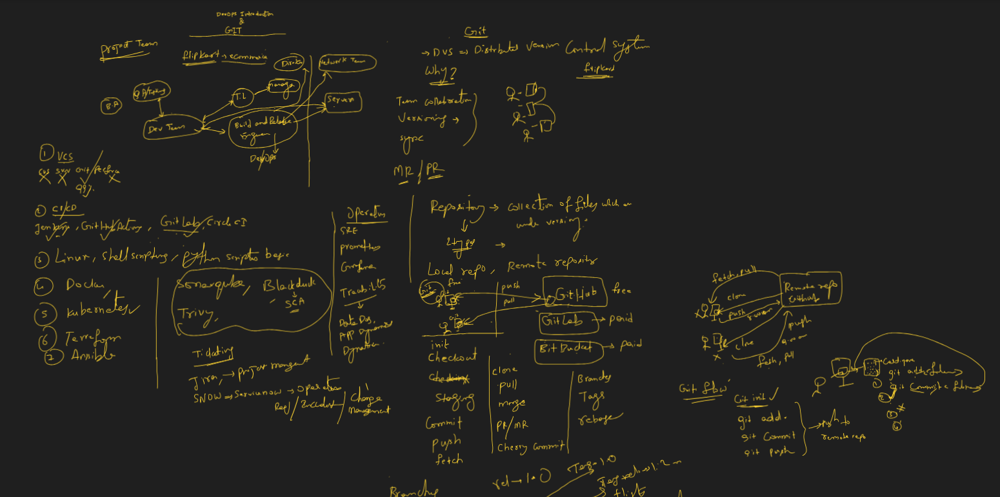
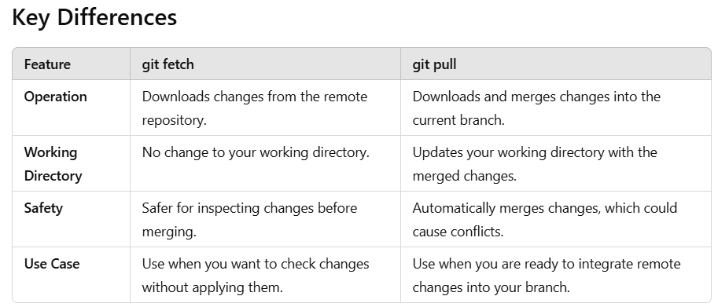

# Git Overview

## Class notes:


**Git** is a distributed version control system used to track changes in source code during software development. It allows multiple developers to collaborate on a project by managing the history of code changes, enabling efficient branching, merging, and collaboration.

## Key Features of Git

1. **Distributed**: Every developer has a complete copy of the entire repository, including its history, on their local machine.
2. **Version Control**: Tracks changes to files, allowing you to view the history of modifications and revert to previous versions.
3. **Branching and Merging**: Git allows for easy branching (creating separate lines of development) and merging changes back into the main project.
4. **Collaboration**: Multiple developers can work on the same project without interfering with each other’s work, thanks to features like branching and pull requests.

# Common Git Terminologies

This document covers some of the most commonly used Git terminologies.

## 1. **Repository**
A **repository** (or **repo**) is a collection of files and their entire revision history. It contains all the project files, including the `.git` directory, which stores metadata and version history.

- **Local Repository**: The version of the repository on your local machine.
- **Remote Repository**: A version of the repository hosted on a server, such as GitHub or GitLab.

### Example to initiliaze an empty repository:
```bash
git init
```

## 2. Commit
A commit is a snapshot of changes in your project. Each commit has a unique identifier (hash) and records who made the changes, when they were made, and a message describing the changes.
```bash
git commit -m "Add new feature"

```
## 3. Branch
A branch is a pointer to one of the commits in the repository. It allows you to work on different parts of the project independently without affecting the main codebase. The default branch is typically called main or master.
```bash
git branch feature-branch
git checkout feature-branch
```

## 4. Checkout
The checkout command allows you to switch between branches or restore files in the working directory to a specific state.
```bash
git checkout main  # Switch to the 'main' branch
```

## 5. Merge
Merge combines the changes from different branches into one. It is usually performed when a feature branch is ready to be incorporated into the main branch.
```bash
git merge feature-branch
```

## 6. Pull
The pull command is used to fetch changes from a remote repository and merge them into your local branch. This is a combination of git fetch and git merge.

```bash
git pull origin main
```

## 7. Push
The push command is used to upload your local changes (commits) to a remote repository.
```bash
git push origin main
```

## 8. Clone
The clone command is used to create a copy of an existing remote repository onto your local machine.
```bash
git clone https://github.com/user/repository.git
```

## 9. Staging Area (Index)
The staging area (or index) is where you place changes before committing them. You add files to the staging area using the git add command.
```bash
git add <file_name>
```

## 10. Tag
A tag is a reference to a specific point in Git history, usually used to mark releases or important milestones in the project.
```bash
git tag v1.0.0
```

## 11. Fork
A fork is a copy of someone else's repository. It allows you to freely make changes without affecting the original project. Forks are commonly used in open-source projects.

## 12. Remote
A remote is a version of the repository that is hosted on the internet or a network. It typically refers to repositories hosted on services like GitHub, GitLab, etc.
```bash
git remote add origin https://github.com/user/repository.git
```

## 13. Fetch
The fetch command is used to download changes from a remote repository to your local machine, but it does not automatically merge the changes. You can then inspect the changes and decide when and how to merge them.
```bash
git fetch origin
```

## 14. Diff
The diff command shows the differences between files or commits, helping you see what has changed.
```bash
git diff
```

## 15. Rebase
Rebase is an alternative to merging, which involves moving or combining a sequence of commits to a new base commit. This helps to keep the project history linear.
```bash
git rebase main
```

## 16. HEAD
HEAD refers to the current commit your working directory is based on. It is usually the latest commit on the current branch.
```bash
git log --oneline
```

# Git Cherry-pick

**Cherry-pick** in Git is a command used to apply the changes from a specific commit (or commits) from one branch into another. This command is useful when you want to selectively apply a change without merging an entire branch.

### When to Use Cherry-pick
Cherry-picking is useful when you want to:
- Apply a bug fix from one branch to another without merging all changes.
- Selectively apply commits across different branches.
- Avoid merging unwanted changes while still benefiting from specific fixes or features.

## How Cherry-pick Works
When you perform a cherry-pick, Git takes the changes introduced in a commit from another branch and applies them to the current branch. This creates a new commit with a different hash but identical changes.

### Cherry-pick Syntax:
```bash
git cherry-pick <commit_hash>
```

### Git Cherry-pick Example

**Cherry-pick** in Git is a command used to apply the changes from a specific commit (or commits) from one branch into another. This command is useful when you want to selectively apply a change without merging an entire branch.

#### Example: Using Cherry-pick

### Scenario
You have two branches: `feature` and `main`. There is a specific commit in the `feature` branch that fixes a bug, but you only want to apply that fix to the `main` branch.

### Step-by-Step Process

#### Step 1: Find the commit hash
First, find the commit hash of the change you want to apply using `git log` or `git log --oneline`.

```bash
git log --oneline

a1b2c3d Commit message for bug fix in feature branch
4e5f6g7 Another commit in the feature branch
8h9i0j1 Initial commit in the feature branch

In this case, the commit hash for the bug fix is a1b2c3d.

Step 2: Switch to the main branch
Next, switch to the branch where you want to apply the commit (main in this case).

git checkout main

Step 3: Cherry-pick the commit from the feature branch
Now, cherry-pick the commit from the feature branch by using its commit hash.

git cherry-pick a1b2c3d

Git will apply the changes from the commit a1b2c3d to the main branch. If there are no conflicts, a new commit will be created in the main branch with the changes.

Example output:
[main a4d5e6f] Commit message for bug fix in feature branch

Step 4: Push the Changes
Once the cherry-pick is successful, you can push the changes to the remote repository.
git push origin main

Handling Multiple Commits
You can also cherry-pick a range of commits by specifying a commit range.
git cherry-pick <start_commit>^..<end_commit>
```

# Difference Between `git fetch` and `git pull`

`git fetch` and `git pull` are both commands used to retrieve updates from a remote repository. However, they operate differently.

## 1. **git fetch**
- **Purpose**: Fetches updates from a remote repository but does **not** automatically merge them with your local working branch.
- **What it does**: It downloads the latest changes from the remote repository into your local repository's remote-tracking branches. You can inspect these changes before deciding to merge or rebase them.
- **Usage**: Ideal when you want to check the latest changes in the remote repository without affecting your current working directory.
  
### Example:
```bash
git fetch origin
```

## 2. git pull
Purpose: Fetches updates from a remote repository and automatically merges the changes into your current working branch.
What it does: It performs a git fetch followed by a git merge or git rebase (depending on your configuration). It updates your working directory and the local branch by merging the remote changes.
Usage: Ideal when you want to update your current branch with the latest changes from the remote repository.

```bash
git pull origin main
```
